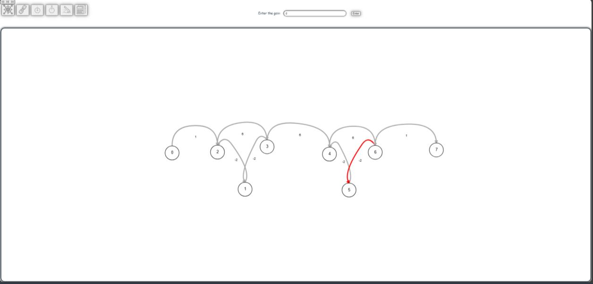
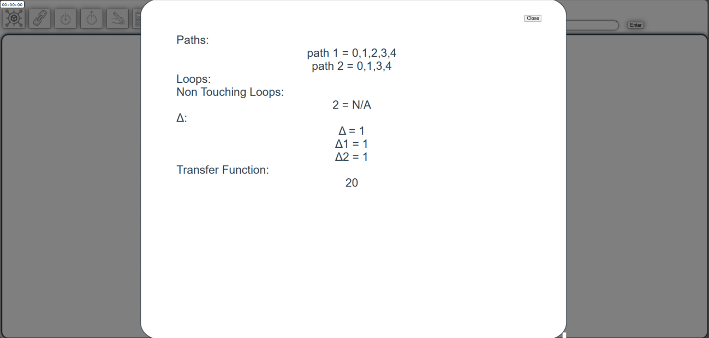
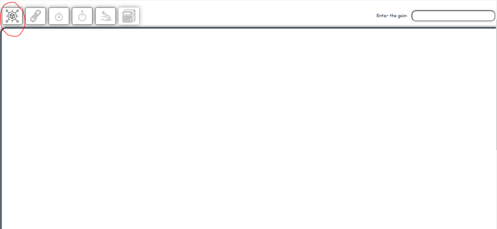
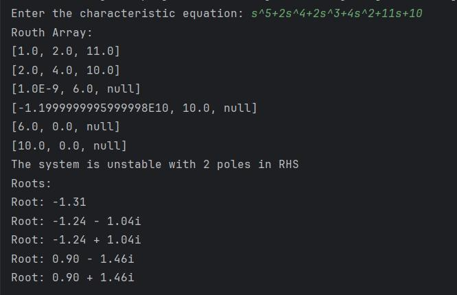

# Signal Flow Graph & Routh Stability Criterion

<p align="center">
  <a href="#key-features">Key Features</a> •
  <a href="#how-to-use">How To Use</a> •
  <a href="#dependencies">Dependencies</a> •
  <a href="#app-design">App Design</a> •
  <a href="#future-features">Future Features</a> •
  <a href="#documentation">Documentation</a> •
  <a href="#contact">Contact</a> •
  <a href="#license">License</a> •
  <a href="#acknowledgements">Acknowledgements</a>
</p>

---

## Dependencies

- **Frontend**
  - [Vue.js](https://vuejs.org/)
- **Backend**
  - [Spring Boot](https://spring.io/projects/spring-boot)

---

## How To Use

```bash
# Clone this repository
$ git clone https://github.com/Mohamed-Mohamed-Ibrahim/Signal-Flow-Graph.git

# Go into the repository
$ cd Signal-Flow-Graph

# Open 2 command lines

# First cli
$ cd frontend
$ npm install
$ npm start

# second cli
$ cd backend
$ java -jar backend.jar

```

# Signal Flow Graph

### 1) Problem Statement 

Signal flow graph representation of the system. Assume that total number of nodes and numeric branches gains are given. 

Required: 

1. Graphical interface.

2. Draw the signal flow graph showing nodes, branches,gains, … 

3. Listing all forward paths, individual loops, all combination of n non-touching loops. 

4. The values of Δ , Δ1 , …, Δm where m is number of forward paths. 

5. Overall system transfer function.

### 2) Main Features of the Program and Additional Options

   1. Draw the signal flow graph
   2. Assignment of values to the branches
   3. Assignment of input and output node
   4. Solve the signal flow graph to get the transfer function
   5. Listing all forward paths, individual loops, all
   combination of n non-touching loops.

#### 3) Data Structure 

    ▪ Lists (ArrayList): Used for representing the graph, paths, loops, non-touching loops, gains, and other data structures. 

    ▪ Stacks: Utilized for backtracking and maintaining state during loop detection and combination processes. 

    ▪ Custom data structure (MyPair): Represents pairs of integers used to describe edges in the graph. 

### 4) Main Modules

Backend:

    ▪ Initialization (init()): Initializes data structures and prepares the graph for analysis. 

    ▪ Finding Paths (findAllPaths()): Finds all paths from the source to the destination node in the graph. 

    ▪ Finding Loops (findLoopsGains()): Detects all loops within the graph and calculates their gains. 

    ▪ Combining Loops (combine()): Combines non-touching loops to analyze higher-order loop interactions. 

    ▪ Computing Transfer Function (overAllTransferFunction()): Computes the overall transfer function of the signal flow system.

Frontend: 

    ▪ This is the GUI of the program. Through it, we can draw the graph and send data to the backend. 

### 5) Algorithms Used 

    ▪ Depth-First Search (DFS): Used for finding all paths in the graph and detecting loops. 

    ▪ Backtracking: Utilized in combination with DFS for loop detection and non-touching loop combination. 

    ▪ Combinatorial Techniques: Employed to combine non-touching loops efficiently. 

### 6) Sample Runs 

1. 1st Test Case
   
   
2. 2nd Test Case
   
   
3. 3rd Test Case
   
   
4. 4th Test Case
   
   
5. 5th Test Case
   
   

### 7) Simple User Guide: 

- You have to download frontend code and backend code.

- Verify the presence of Node.js on your system.

- Utilize the command "npm i serve" to install the requisite modules. 

- Launch the front end using the command "npm run serve."

- after this you click on the link in the terminal and this window will appear: 


- You can choose add nodes using this button:




- You can link node using this button:


- You can determine the input node using this button: 


- You can determine the output node using this button: 


- You can enter the gain by clicking on this button and finally enter the gain in this text box and click on the link then enter:

- Finally, you can click on this button to show all information like transfer function, paths, loop, and self loops. 


# Routh Stability Criterion

### 1) Problem Statement 

Given the characteristic equation of a system, implement the Routh-Hurwitz stability criterion to determine if the system is stable or not. If the system is unstable, list the number and values of poles in the right-half plane (RHP) of the s-plane. 

### 2) Main Features of the Program and Additional Options

• Parses the characteristic equation to extract coefficients. 

• Constructs the Routh array based on the extracted coefficients. 

• Determines system stability using the Routh-Hurwitz criterion. 

• Finds the roots of the characteristic equation and identifies poles in the RHP. 

• Displays the Routh array, system stability status, and roots of the equation. 

### 3) Data Structure 

• Map: Used to store coefficients for each power of 's' in the characteristic equation. 

• Double Array: Represents the Routh array, initialized with null values for ease of calculation. 

### 4) Main Modules

• constructRouthArray: Constructs the Routh array based on the coefficients of the characteristic equation. 

• countSignChanges: Counts the number of sign changes in the first column of the Routh array. 

• findRoots: Finds the roots of the characteristic equation using the LaguerreSolver. 

### 5) Algorithms Used 

• Routh-Hurwitz Criterion: Determines system stability based on the number of sign changes in the first column of the Routh array. 

• Laguerre's Method: Finds the roots of the characteristic equation using the LaguerreSolver. 

### 6) Sample Runs 

1. 1st Test Case
   
2. 2nd Test Case
   
3. 3rd Test Case
   
4. 4th Test Case
   

### 7) Simple User Guide

1)Input the characteristic equation of the system as shown in sample runs enter all coefficients even if they are 1 and don't use spaces. 

2)The program will display the Routh array, system stability status, and roots of the characteristic equation. 

3)If the system is unstable, the program will also list the number and values of poles in the right-half plane. 

---

## Contact

1. [**Mohamed Hassan**](https://github.com/mohassan5286)
2. [**Omar Hany**](https://github.com/OmarHani4306)
3. [**Mohamed A Fahrat**](https://github.com/mohamedafarhat)
4. [**Ahmed Samir**](https://github.com/ahmedshepl4242)
5. [**Mohamed Mohamed Ibrahim**](https://github.com/Mohamed-Mohamed-Ibrahim)

---

## License

Distributed under the MIT License. See [LICENSE](./LICENSE) for more information.

---


